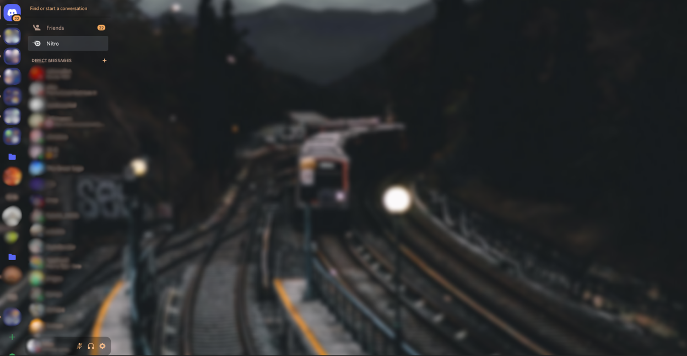

# discord-theme
My Discord Style (Browser CSS)

How to use?

Install Stylus for your browser and copy the script from this repo into it.

## Screenshot
*Note: The blue coloring for the sidebar has been fixed in the latest version*

